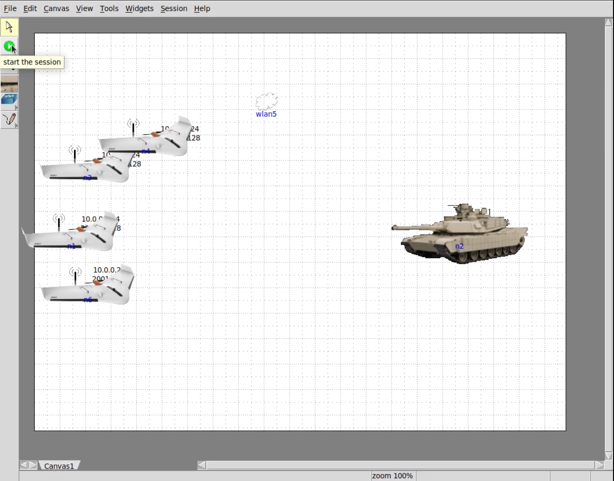
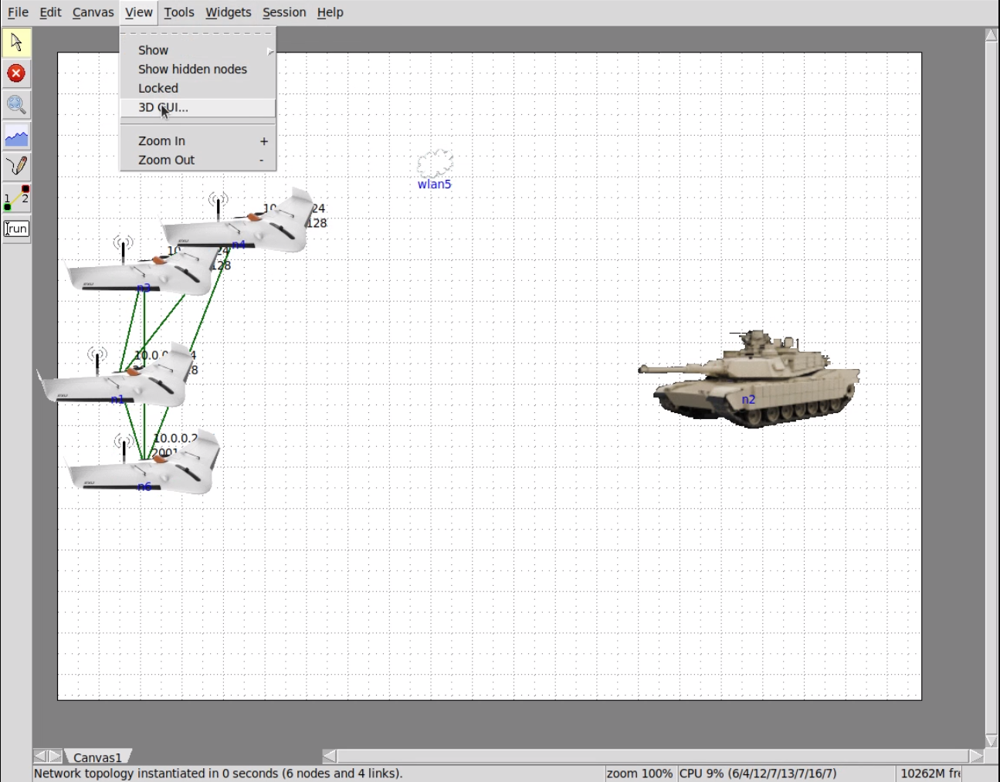
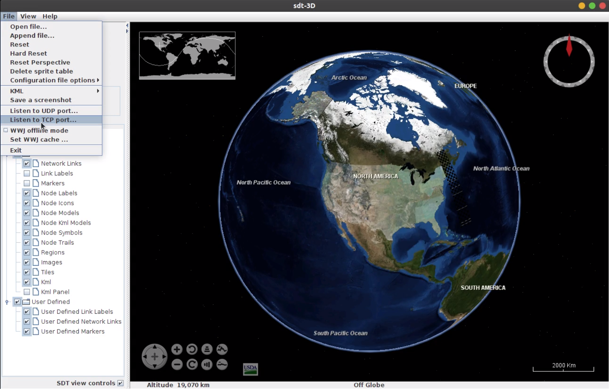
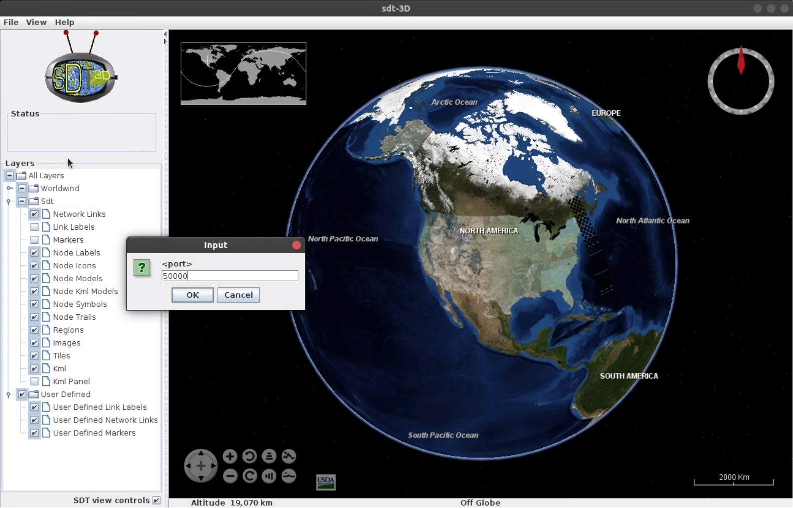
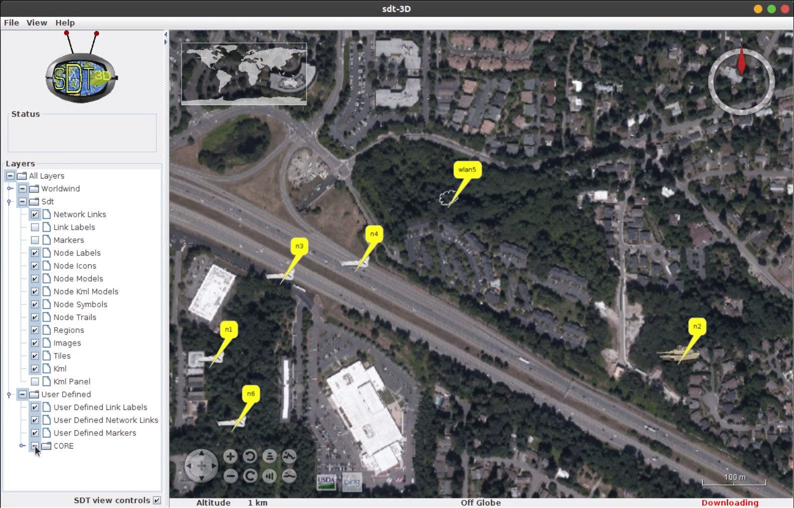
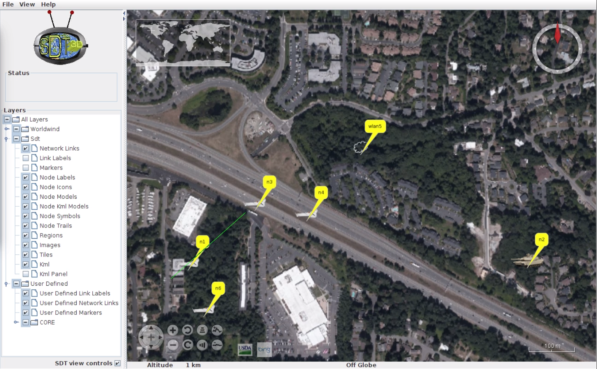
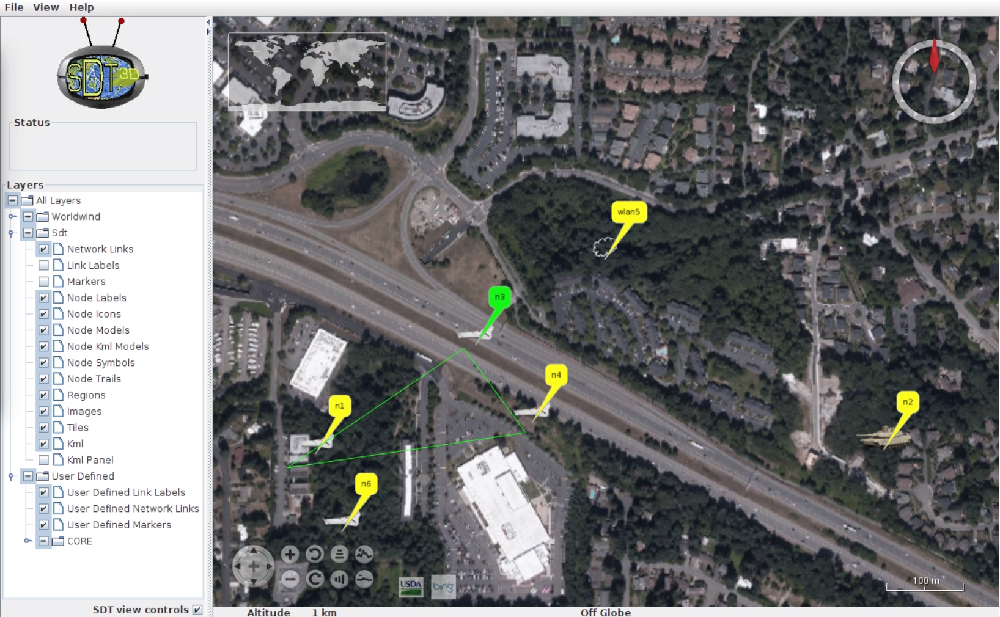
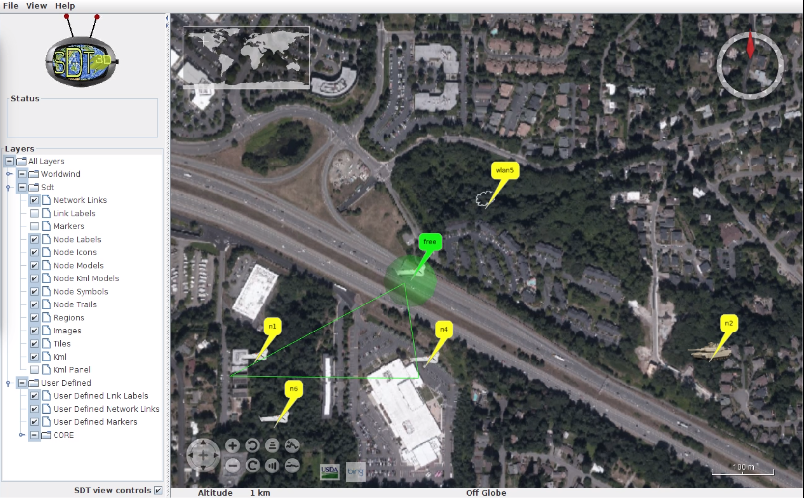

# Core & SDT3D & SDTCMD

This document is manual for Core, sdt3d and sdtcmd.

Environment
> Core - 6.3.0
> Std3d - 2.2

# Connect core with sdt3d

1. Start the core session

2.   View -> 3D GUI

# 

3. Run the python core script 

   

4. File -> Listen to TCP port

5. Input 50000 for the port number

6. You can see the nodes connected from core

**video instruction**
 * [Quick Tutorial Video - simulation on CORE&SDT3D](https://youtu.be/QXDRzjHuMwo)

# Control the sdt3d, using sdtcmd

Using sdtcmd,

We can control/draw nodes, lines, shapes on sdt3d.

## Draw line 

`sdtcmd link [nodeNumber1],[nodeNumber2],[Color]`

ex - `/stdcmd link 1,3,green`

## Change label color

`sdtcmd node [nodeNumber] label [Color]`

ex - `/stdcmd node 3 label green`

## Change label name

`sdtcmd node [nodeNumber] label on [Name]`

ex - `/stdcmd node 3 label on free`

## Draw symbol

`sdtcmd node [nodeNumber] symbol [Symboltype],[Color]`

ex - `/stdcmd node 3 symbol sphere,green`
